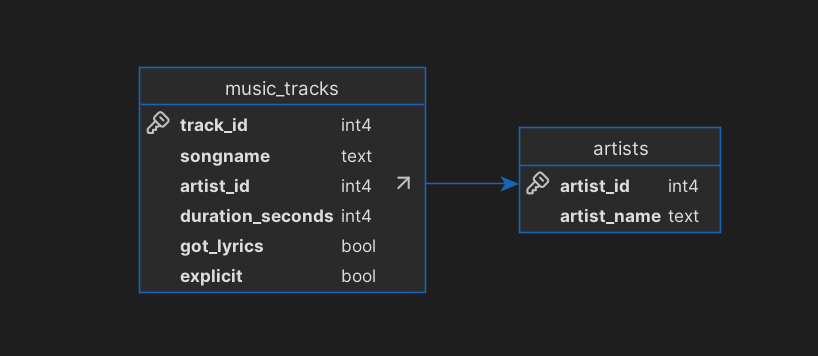
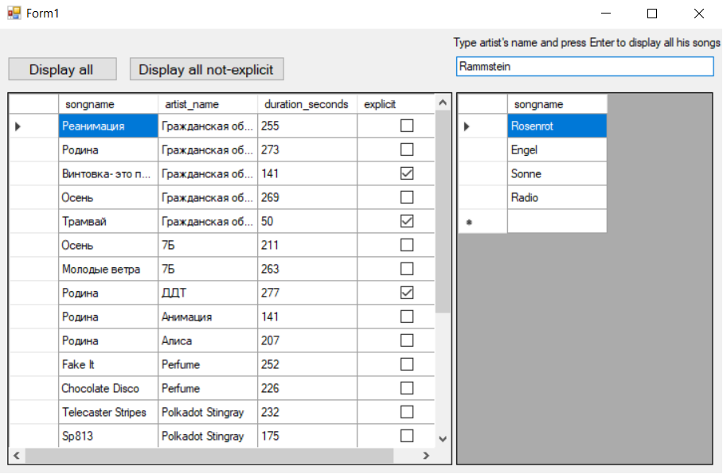

# Database viewer materials

Простое приложение-прототип, написанное в Winforms для просмотра данных о музыкальных треках, выводе треков конкретного исполнителя

---

## 🧱 Стек технологий

- C# 
- .NET Framework
- PostgreSQL
- Windows Forms
- Npgsql

---

### Структура проекта
 - test_db_3 - проект приложения
 - test_db_backup_script.sql - скрипт создания базыданных

### Модель данных



### Пример работы программы



### Скрипт создания БД

```sql
--
-- PostgreSQL database dump
--

SET statement_timeout = 0;
SET lock_timeout = 0;
SET idle_in_transaction_session_timeout = 0;
SET transaction_timeout = 0;
SET client_encoding = 'UTF8';
SET standard_conforming_strings = on;
SELECT pg_catalog.set_config('search_path', '', false);
SET check_function_bodies = false;
SET xmloption = content;
SET client_min_messages = warning;
SET row_security = off;

SET default_tablespace = '';

SET default_table_access_method = heap;

--
-- TOC entry 217 (class 1259 OID 16389)
-- Name: artists; Type: TABLE; Schema: public; Owner: postgres
--

CREATE TABLE public.artists (
    artist_id integer NOT NULL,
    artist_name text NOT NULL
);


ALTER TABLE public.artists OWNER TO postgres;

--
-- TOC entry 218 (class 1259 OID 16396)
-- Name: music_tracks; Type: TABLE; Schema: public; Owner: postgres
--

CREATE TABLE public.music_tracks (
    track_id integer NOT NULL,
    songname text NOT NULL,
    artist_id integer,
    duration_seconds integer NOT NULL,
    got_lyrics boolean DEFAULT false NOT NULL,
    explicit boolean DEFAULT false NOT NULL
);


ALTER TABLE public.music_tracks OWNER TO postgres;

--
-- TOC entry 4647 (class 2606 OID 16395)
-- Name: artists artists_pkey; Type: CONSTRAINT; Schema: public; Owner: postgres
--

ALTER TABLE ONLY public.artists
    ADD CONSTRAINT artists_pkey PRIMARY KEY (artist_id);


--
-- TOC entry 4649 (class 2606 OID 16404)
-- Name: music_tracks music_tracks_pkey; Type: CONSTRAINT; Schema: public; Owner: postgres
--

ALTER TABLE ONLY public.music_tracks
    ADD CONSTRAINT music_tracks_pkey PRIMARY KEY (track_id);


--
-- TOC entry 4650 (class 2606 OID 16405)
-- Name: music_tracks music_tracks_artist_id_fkey; Type: FK CONSTRAINT; Schema: public; Owner: postgres
--

ALTER TABLE ONLY public.music_tracks
    ADD CONSTRAINT music_tracks_artist_id_fkey FOREIGN KEY (artist_id) REFERENCES public.artists(artist_id);


-- Completed on 2025-07-15 16:47:15

--
-- PostgreSQL database dump complete
--
```
